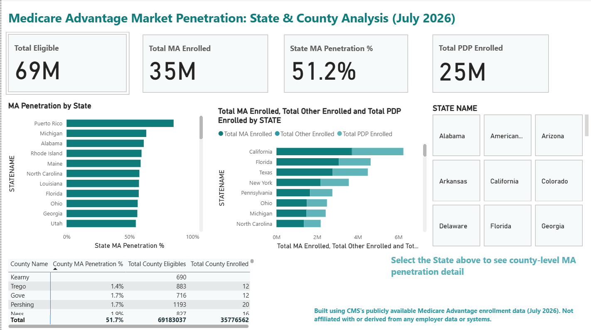

# Medicare Advantage Market Penetration Dashboard

A Power BI dashboard analyzing Medicare Advantage (MA) enrollment and market penetration across U.S. states and counties, using CMS's own publicly published enrollment data (July 2026).



## Background

I work in Medicare Advantage operations — enrollment validation, encounter data quality, and CMS compliance. This dashboard applies the same lens I use professionally (validating data, tracing discrepancies to root cause, reconciling across sources) to a public dataset, as a self-directed skill-building project.

**This project is built entirely on CMS's publicly available data. It is not affiliated with, and does not reference or derive from, any employer data, systems, or internal reporting.**

## The Question

How does Medicare Advantage adoption vary across states and counties, and which markets have the highest/lowest penetration relative to their Medicare-eligible population?

## Key Findings

- **Puerto Rico, Michigan, and Alabama** show the highest state-level MA penetration (60%+), while several other states trail well behind - a gap likely driven by plan availability and provider network density by market.
- County-level penetration varies dramatically even within the same state, which the dashboard's drill-down view surfaces directly.
- **National MA penetration sits at ~51.2%**  - just over half of eligible beneficiaries are enrolled in MA rather than Original Medicare.

## Data Quality Notes (the part I actually spent the most time on)

Working with this dataset surfaced two real data-quality issues that had to be handled deliberately, not just cleaned away:

1. **A mathematically impossible penetration rate.** One small territory (Virgin Islands-"St. John") showed a recomputed penetration rate of 320%: CMS's own `Enrolled` count exceeded their own `Eligibles` count for that row. CMS's published `Penetration` column masks this by capping at 100%, but recalculating from raw sums exposes the inconsistency. Handled by filtering to counties with more than 500 eligible beneficiaries, which removes this and other small-sample distortions.
2. **An administrative placeholder row.** "Pending County Designation" is not a real county. It's a CMS bucket for beneficiaries whose county assignment is still being processed. Filtered out explicitly so it doesn't get misread as a geographic data point.

## Methodology

County-level penetration is calculated as a **weighted rate**, not a simple average of the published county percentages:

```dax
County MA Penetration % =
DIVIDE(
    SUM(State_County_Penetration_MA[Enrolled]),
    SUM(State_County_Penetration_MA[Eligibles])
)
```

A simple average would treat a county with 500 eligible beneficiaries the same as one with 500,000 — this approach weights by actual population size.

## Dashboard Components

- **KPI row:** Total Eligible, Total MA Enrolled, State MA Penetration %, Total PDP Enrolled
- **MA Penetration by State:** ranked bar chart across all states/territories
- **Enrollment Mix by State:** stacked breakdown of MA vs. Original Medicare vs. standalone Part D (PDP)
- **County-level drill-down:** a state slicer filters a county-level table showing penetration, eligibles, and enrollment for every county in the selected state

## Data Source

- **CMS Medicare Advantage/Part D Contract and Enrollment Data**, July 2026 reporting period
- Source: [CMS Data & Research page](https://www.cms.gov/data-research/statistics-trends-and-reports/medicare-advantagepart-d-contract-and-enrollment-data)
- Raw files are not included in this repo; download directly from CMS to reproduce

## Tools

- Power BI Desktop (Power Query for cleaning, DAX for measures)
- Core measures: `Total Eligible`, `Total MA Enrolled`, `State MA Penetration %`, `County MA Penetration %`

---

*Built by Charitha Velamala as a portfolio project.*
